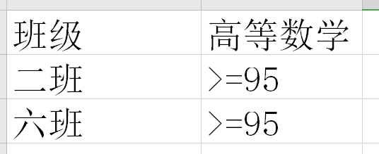
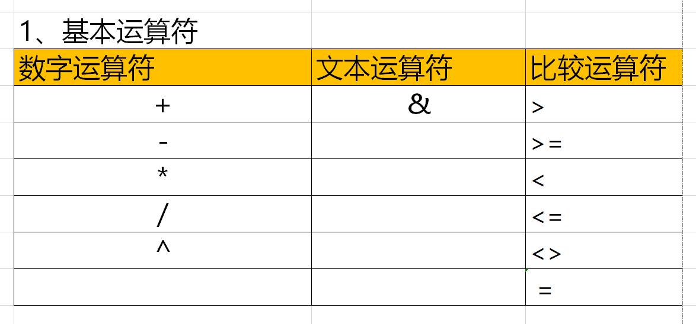
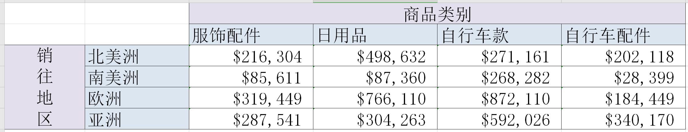
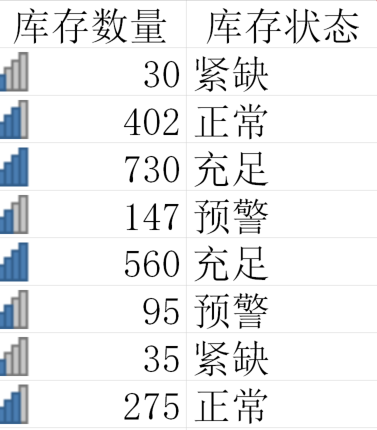
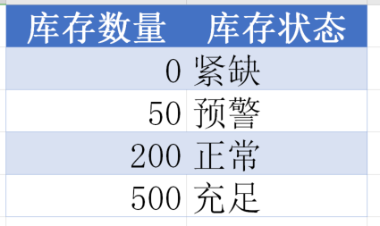

[TOC]

# Excel 基本操作

## 1. 数据录入篇

### 1.1 输入分数

**0 a/b**

E.G.

- 输入分数`3/4`，应该输入`0 3/4`，而不是直接输入`3/4`，否则会被转义为日期，0表示前面的整数。

- 输入`1 3/4`，输入`1 3/4`，表示一又四分之三.

### 1.2 输入文本

- 在单元格靠右为数字，靠左为文本.

- **数字转文本0**：在数字前面加上英文单撇==`==.

- 如9000 -> `9000.

- 数字可以参与计算，文本不可以.

### 1.3 输入日期和时间

日期:

- 法一:直接输入`2024/1/12`.

- 法二:输入`2024-1-12`，即可转义为`2024/1/12`.

- 法三:输入今日日期：`Ctrl+;`.

时间:

- 法一:直接输入`13:14`.
- 法二:输入今日日期：`Ctrl+Shift+;`.

日期和时间：

- 输入今日日期和时间：`Ctrl+;`+空格+`Ctrl+Shift+;`.

## 2. 文件操作篇

### 2.1 工作表标签常用操作

鼠标移动：

- 工作表移动位置：左键按住 + 拖动.

- 工作表复制副本并移动到相应位置：`Ctrl` +  左键按住 + 拖动.

- 选中多个工作表：`Ctrl`+左键单击，可以对多张工作表内容进行统一操作，提高效率.

- 连续选中多个工作表：左键单击工作表A，按住`Shift`，左键单击工作表B，实现A到B的连选，可以实现统一操作.

右键单击弹出菜单也可以实现相应操作.

### 2.2 行和列常用操作

- 插入单元格：开始 > 行和列 > 插入单元格
	- 单行插入：单击
	- 连续插入：拉选 行或列标签（”坐标“）
	- 不连续插入：`Ctrl`加选或减选

- 调整行高和列宽：开始 > 行和列 > 插入单元格
	- 最适合行高/列宽：选中区域，左键双击任意两行/列标签之间的交界线 

### 2.3 单元格常用操作

==**Ctrl+1 **快捷弹出单元格格式对话框==

1. **移动(剪切)单元格**：选中单元格区域/单个单元格/行/列.
- `Ctrl`+左键按住拖动边框线 即可移动到空白区域，原区域不再有内容.
	
- 当拖动到有内容区域会覆盖原有内容，`Shift`+左键按住拖动边框线 可以移动到某指定位置而不覆盖原有内容.
	
2. **复制单元格**：选中单元格区域/单个单元格/行/列

	- `Ctrl`+左键按住拖动边框线 移动到空白区域实现复制.

	- 当拖动到有内容区域会覆盖原有内容，`Ctrl`+`Shift`+左键按住拖动边框线 可以复制到某指定位置而不覆盖原有内容.

3. **去掉单元格区域边框上的蚂蚁线**：

	- 选中单元格+`Esc`

4. **定位单元格及区域**：

	- 单击
	- 拖动
	- 箭头
	- 滚动条
	- 名称框
	- `Shift`，类似于Word

### 2.4 对齐方式设置

- 标题合并单元格后，设置==分散对齐==结合增加/减少缩进量，可以合理设置标题的对齐样式.
	- 减少缩进量：更分散
	- 增加缩进量：更聚拢

### 2.5 数字格式设置

**数字格式**：只是改变了数字的显示形式，但并没有改变数字本身的数值大小.

**日期和数字之间的关系**：

数字表示距离1900/1/1的天数.

日期可以直接作差来得到相距1900/1/1的天数.

E.G.

- 1表示1900/1/1
- 10表示1900/1/10

**时间和数字之间的关系**：

用0—1来度量（表示）00:00:00—24:00:00.

相当于一个小时就是1/24~0.04166667.

E.G.

- 0.5就代表12:00:00

## 3. 公式函数篇

在公式栏选中部分运算过程，单击`F9`，就可以查看所对应的结果.

### 3.1 公式运算符

- 数字运算符
	- `+`
	- `-`
	- `*`
	- `、`
	- `%`（除100）
	- `^`（幂）
- 比较运算符
- 结果为`FALSE`或`TRUE`，条件判断后面可以用于`IF`判断.
	- `=`
	- `<>`(不等于)
	- `>`
	- `>=`(大于等于)
	- `<`
	- `<=`(小于等于)
- 引用运算符
	- `:`（连续）
	- `,`（并集）
	- `空格`（交集)
- 连接运算符
	- `&`

### 3.2 单元格引用方式

**相对引用**：

单元格按住右下角拖动时(或双击)，往下拖动填充，列标不变，行号会变化；往右拖动填充，行号不变，列标会变化.

**绝对引用**：

- 用`$`来固定某个行标或列标，可以使单元格拖动的时候固定不变.

- 快捷键是`F4`

E.G.

`=F10/$F$11`

**混合引用**：

相对引用和绝对引用的混合.

- 行号锁定 `=C6/F$6`

	| ==249679== | 135923 | 526348 |
	| :--------: | :----: | :----: |
	|   249679   | 135923 | 526348 |
	|   249679   | 135923 | 526348 |
	|   249679   | 135923 | 526348 |
	|   249679   | 135923 | 526348 |

- 列号锁定 `=C6/$F6`

	| ==249679== | 249679 | 249679 |
	| :--------: | :----: | :----: |
	|   230722   | 230722 | 230722 |
	|   903017   | 903017 | 903017 |
	|   404579   | 404579 | 404579 |
	|   897452   | 897452 | 897452 |

###  3.3 数组函数概念

`={100,2;200,3;300,4;400,5;500,6;600,7}`

- 可以快速输入数据，快捷键是`Ctrl+Shift+Enter`，选中区域`A`，再输入`=`再选中区域`B`，`Ctrl+Shift+Enter`，

- 就可以将`B`的数据复制到`A`中.

- 数组是一个整体的数据，不能对其中单个数据进行处理，只能对数组整体进行处理，如修改等.

### 3.4 数组公式应用

求和快捷键:`Alt + =`.

### 3.5 定义名称

选中 > 公式 > 名称管理器 > 粘贴

## 4. 单元格和表格样式

==开始 > 单元格样式，表格样式.==

**合并单元格样式**：

- 开始 > 单元格样式 > 合并样式.

- 意思是把打开的**工作簿**原来已经自定义好了的单元格样式，合并到其他打开的工作簿，这样就不用重新设置样式了.

**单元格区域与表格转换**：表格有**表格工具**选项卡，表格功能更加丰富，而单元格区域没有.

- 单元格区域转换为表格：
	- 法一：套用表格样式的时候，勾选第二个转换为成表格.
	- 法二：插入 > 表格(`Ctrl + T`).

- 表格转换为单元格区域：
	- 表格工具 > 转换为区域

## 5. 条件格式

==开始 > 条件格式==.

## 6. 选择粘贴选项

## 小黑课堂笔记

### 基础操作篇

1. 快捷键：连续向右/下选择一块区域：`Ctrl+Shift+右方向键/下方向键`。

2. **一个汉字代表2个字符。**

3. 当单元格出现`####`时，说明列宽不够，需要调整列宽。

4. 跨工作簿移动或复制，要把两个工作簿同时打开。

5. **手动换行**：把光标定位在要换行的位置，按`Alt+Enter`，单纯按`Enter`是不行的。

6. 显示当前系统日期：`Ctrl+;`，或者输入`2025-8-12`。

7. 日期后追加星期：自定义类型  -> 去掉`@&`后[加空格]再追加4个`a`。

8. 不合并单元格居中：设置单元格格式：水平方式为**跨列居中**。

9. 双击某个单元格的某一条边，可以定位到表格连续区域的对应最边边位置，比如，双击上边缘，回到表头；双击下边缘，定位到底部。

10. 条件格式：为满足特定格式的单元格设置格式。设置条件，表达格式，目的是突出显示。

11. 高级筛选：

	- **在要放置筛选结果的表进行高级筛选**。

	- 条件区域的书写：条件同行表示“且”，条件不同行表示“或”。

		如图：筛选二班和（或）六班且高等数学≥95分的学生记录。

		

12. 定位 Ctrl+G

	- 定位错误值：数据勾选公式，数据类型勾选错误即可；

	- 定位完成后光标不要点其他地方，输入结果之后，一定要按`Ctrl+Enter`进行批量填充。

		当然，想对一个空白区域进行批量填充，也可以选中一块空白区域后，在键盘中输入填充内容后，在按`Ctrl+Enter`后即可批量复制填充。

13. 数据有效性中的允许：序列，就是插入下拉列表的意思，也可以从单元格选择下拉选项，分隔符要用英文逗号。

14. 分类汇总：

	- 分类汇总之前先按分类字段进行排序，将相同字段分在一起先。

	- 如果分类汇总是灰色的，说明套用了表格样式，可以在【表格工具选项卡】中转换为区域或选中表格 -> 右键 -> 表格 -> 转换为区域。

15. 导入外部数据（类似分列，只是导入外部数据可以动态变化）：【数据】选项卡 -> 现有连接。若有身份证、文本、类似日期格式的数据，要先将对应列的格式设置为文本再导入或分列。

16. 在表格中绘制图表，要先选中数据区域才可以绘制图表。

17. **数据透视表**：

	- 要对哪个工作表创建数据透视表就在哪个工作表下点击创建数据透视表。创建的数据透视表可以放在当前工作表下也可以放在其他工作表下。

	- 如果想要将一张表按照某个字段的值，每一个值形成一张表，就要把这个字段首先放到筛选器中。

	- 生成报表：分析选项卡 -> 选项下拉 -> **显示报表筛选页**。

	- 在数据透视表选项卡中：设置了合并且居中带标签的单元格后，最好在设计选项卡 -> 报表布局下拉 -> 以表格形式显示，这样格式才正确：

		

18. 冻结窗格的功能：可以固定标题行或标题列，使得鼠标滚动查看数据时，标题行和标题列始终显示。

19. 取消显示工作表标签：文件 -> 选项 -> 取消勾选“工作表标签”，可以只显示活动工作表，一定要保存一下。

20. 交换2列的位置：选中一列，按住`Shift`不放拖动表格列。

21. **==在excel插入图表时：要先选中用于制作图表的数据区域，再插入图表，这样即可自动生成图表。==**

### 函数公式篇

1. 函数注意事项：函数三要素：等号，函数，参数。

	- 函数开头必须写`=`。
	- 函数内的标点符号必须是英文标点。
	- 函数单元格格式不能是文本。
	- 不区分大小写。

2. 六大基本函数：

	- sum
	- average
	- max
	- min
	- count：求单元格个数。
	- mode：求众数。

3. rank排名函数

	**rank**(排名对象,数据区域,顺序)

	- 第二参数一定要绝对引用。确保排名的数据区域不能变。快捷键：`F4`。
	- 第三参数通常省略不写（默认是0 ，0表降序，1表升序）。
	- 第几名：`"第"&=rank()&"名"`，文本连接，也可以用自定义单元格格式：`“第”0"名"`。
	
4. 逻辑判断函数

  - 简单if：**if**(逻辑判断语句,“是”返回的结果,“否”返回的结果)

  - 多条件if：**ifs**(逻辑判断语句1,逻辑判断语句1”是”返回的结果,逻辑判断语句2,逻辑判断语句2”是”返回的结果)

  	如：`=IFS(F5>=90, 20, F5>=80, 15, F5>=70, 10, F5>=60, 5, F5<60, 0)`：首先检查最高分条件（>=90），然后依次降低（>=80、>=70、>=60）。真的返回结果去掉单引号，直接使用数字（20,15,10,5,0）而不是文本。

  - **iferror**(公式,公式为错误值返回的结果)

  注意：

  1. 条件或返回结果为文本时，一定要加英文状态下的双引号。

5. 条件求个数函数

	- **countif**(区域,条件)：满足单条件求个数。
	- **countifs**(区域1,条件1,区域2,条件2,…)：满足多条件求个数。

	注意：

	1. 不用加引号：引用单元格的时候，用数字的时候。
	2. 条件可以直接引用单元格，不用手写文字。
	3. 用判断逻辑来表达条件的时候需要加引号，如“>1000”。
	4. **注意绝对引用的使用。**

6. 条件求和函数

  - **sumif**(条件区域,条件,求和区域)：满足单条件求和。

  - **sumifs**(求和区域,条件区域1,条件1,条件区域2,条件2,…)：满足多条件求和。

	如果涉及区域拖拽求和，要注意混合引用，如：

	`=SUMIFS(销售资料!$J:$J,销售资料!$D:$D,$B3,销售资料!$F:$F,C$2)`

	

  - sumproduct(区域1*区域2)：乘积求和，区域必须一一对应。

	  注意：

	1. 推荐统一用sumifs防止记错。
	2. 求和区域与条件区域的列数要对应相同。
	3. 条件可以直接引用单元格，不用手写文字。
	4. **注意绝对引用的使用。**

7. 查询函数

  - **跨表纵向查询填充函数**：vlookup()

    - **vlookup**(原表要查询对象，查询的数据区域，结果在数据区域中的列数，精确匹配(false)或者近似匹配(true))

    	即：vlookup(找啥，上哪个表找，告诉我结果在第几列，找一模一样的还是差不多的)。

    - **纵向查询对象必须在查询数据区域的首列**。

    - 第二参数（查询的数据区域）要**绝对引用**。

    - 近似匹配多用于**区间**对应，如：

    	 

  - **数组查询函数**：lookup()

	**lookup**(查询对象，查询的数据区域，结果的数据区域)

	即：lookup(查什么，在什么集合中，集合依次对应什么)

	- 查询的数据区域与结果的数据区域要一一对应。
	- 查询的数据区域和结果的数据区域要用`{}`数组括号。

  - **index**(查询的数据区域，**行号，列号**)：返回具体行列位置的单元格内容，先写行后写列，顺序不能搞反。

  - **match**(查询对象，查询的数据区域，精确匹配(0)或近似匹配(1))：查询一个数在一组数中的位置，返回行号或列号。

  - index和match组成**二维查询**：index(查询的数据区域，match()，match())。

8. 文本函数

	- left（要提取的字符串，提取字符个数）从左边取 。
	- right（要提取的字符串，提取字符个数）从右边取。
	- mid（要提取的字符串，从第几位开始取，提取字符个数）从中间取字符串。
	- len() 返回字符串的字符数。
	- text(字符串，转换的格式)：文本转换函数—将数字转换为特定格式的**文本**。
	- `&`文本连接。要用英文双引号。
	- find(指定字符，字符串，开始进行查找的字符数)：计算指定字符在指定字符串中的位置。
		- 第一个参数要加英文双引号。
		- 第三个参数一般省略不写。
		- 一般与其他函数如mid嵌套使用。

9. 日期函数

  - today()

  - year() 

  - month() 

  - **day**()：求指定日期对应当月的天数。

  - **date**(年，月，日)：将年月日三个值转变成日期格式。

  - **datedif**(起始日期，终止日期，“返回类型”)：求两个日期之间的间隔。常常用于求年龄或工龄。类型有y、m、d、ym(忽略年份，看差几个月)。

  - **yearfrac**(起始日期，终止日期，基准选项)：求两个日期之间的天数占一年的比例。

	**yearfrac适用于一年360天或365天进行计算的情况，基准选项：0 按照一年360天算；3 按照一年365天算。**

  - **weekday**(日期，返回类型)：将某个日期所处的星期转换成数字，常常与if函数结合判断是否加班。

	  注意：

	1. 题目要求一年按照366天计算，先求出相隔的天数，再除以366，再int取整。
	2. 起始或终止日期如果不是引用单元格的话，要加英文引号，如 “2015-9-30”。

10. 数学函数

- **int**(数值)：取整。

- **mod**(被除数，除数)：求余。

- **isodd**(数值)：奇数返回true，偶数返回false，结合if

- 用来根据身份证号求性别。

- **round**(数值，保留小数位数)：四舍五入。

- **roundup**(数值，保留小数位数)：向上取整。

	可用于根据年份求季度：`="第"&ROUNDUP(MONTH(A5)/3,0)&"季度"`。

- **rounddown**(数值，保留小数位数)：向下取整。

- **abs**(数值)：求绝对值。

- **sqrt**(数值)：求算术平方根。

- **large**(区域，K)：求第K大的数。

- **small**(区域，K)：求第K小的数。

11. 补充函数

- **maxifs(求最大/最小/平均值区域,条件区域1,条件1,条件区域2,条件2,…) / minifs()/averageifs()**：条件求最大/最小值/平均值，用法类似**sumifs**。

- column()：求某个单元格的列号。结合vlookup使用。

### 加强

- 高级筛选写条件这块。

- 表格中怎么样使用公式后只保留公式结果，去掉公式，取消跨工作表的链接：

	答：**在原工作表，`Ctrl+A`选中整个工作表，再`Ctrl+C`复制，使用选择性粘贴，快捷键：`Ctrl+Shift+V`，粘贴为数值**。