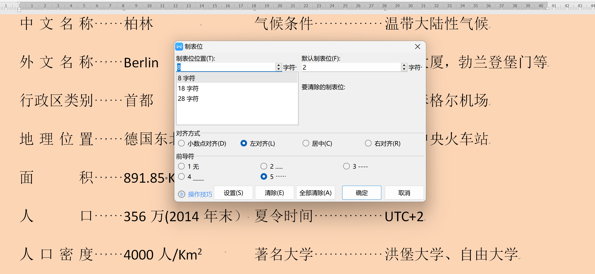
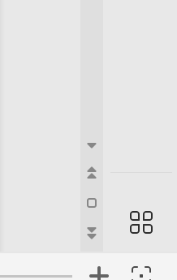
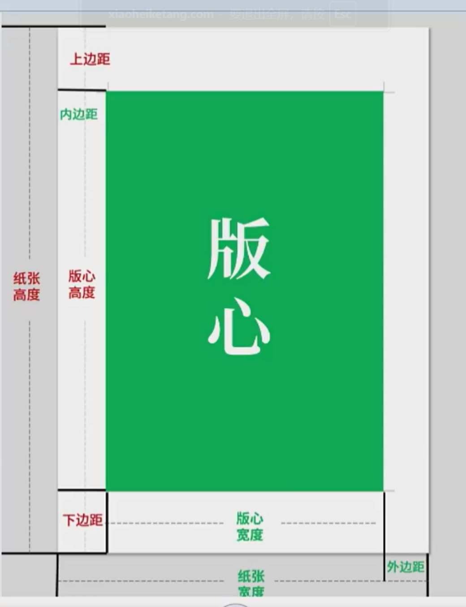
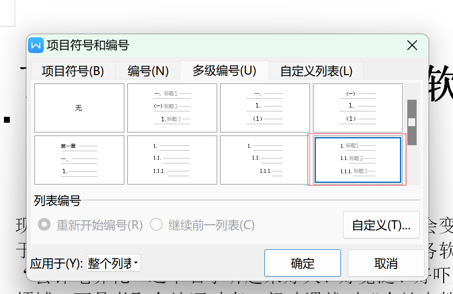
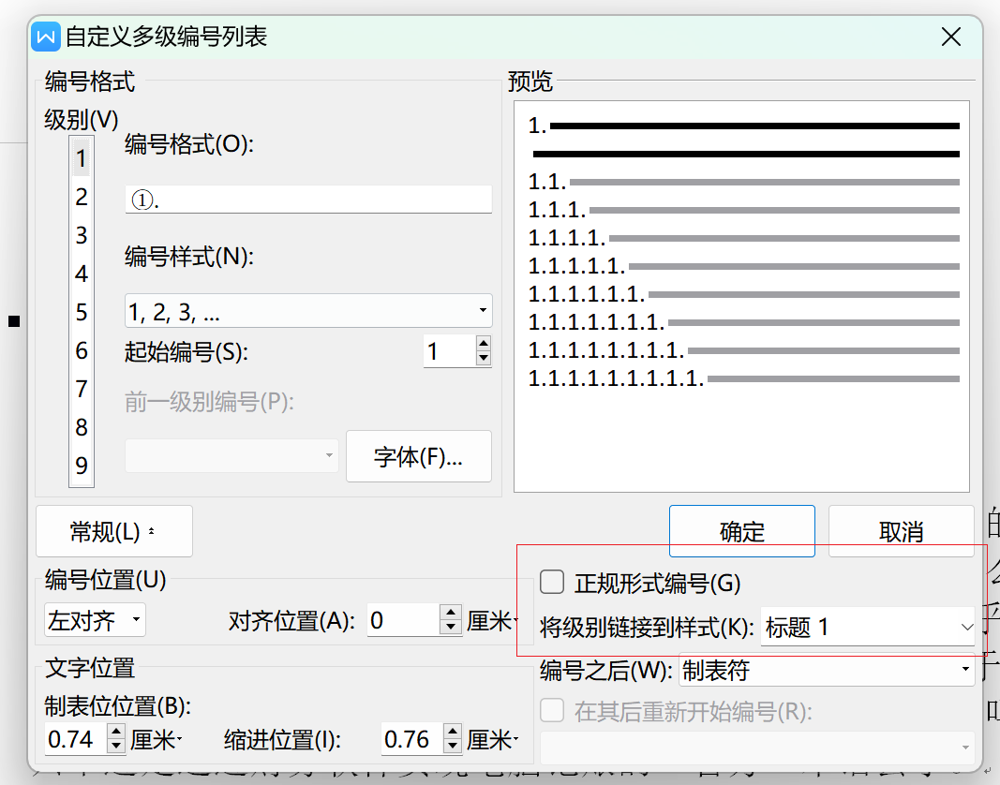

# Word 基本操作

## 1. 内容录入篇

### 1.1 插入特殊符号

- 搜狗输入法键盘按钮输入
- WPS自带插入符号

### 1.2 选中文本内容

- 按住左键：直接拖动鼠标选中
- 全选：Ctrl + A
- 选中单个词：左键双击选中单个词
- 选中某一行：鼠标放于文本外左侧空白区域，左键单击
- 选中某一段落：
	- 鼠标放于文本外左侧空白区域，左键双击
	- Ctrl + 左键单击某段落任意一处
- 选中 A 处（起点）到 B 处（终点）区域的文本：左键单击 A 处 > 找到 B 处 > Shift + 左键单击 B 处
- 选中多个不连续内容：选中一块内容 > 按住Ctrl > 再选中一块内容 > 以此类推……
- 纵向选中：Alt + 左键单击垂直下拉选中

### 1.3 复制、剪切、粘贴

- 复制：
	- Ctrl + C
	- 左键选中 > 按住Ctrl + 拖动到要复制的地方
- 剪切
	- Ctrl + X
	- 左键选中 > 直接拖动到要剪切的地方

## 2. 字体格式篇

### 2.1 字体颜色与突出显示

- 自定义调整颜色：调HSL：色调 > 水平拖动，饱和度 > 垂直拖动，亮度 > 右侧拖动条

### 2.2 拼音指南和更改大小写

- 可以Ctrl + D弹出对话框

- 拼音指南：中文
- 更改大小写：英文

### 2.3 格式刷、F4、清除格式

- 格式刷单击一次：只能刷一次
- 格式刷双击：可以刷多次
- ==选中区域 + `F4`==表示把刚才执行的操作再重复执行一遍
- 清除格式：选中区域 + 单击橡皮擦按钮，即可恢复到默认格式

## 3. 段落格式篇

### 3.1 认识段落标记

- 硬回车：Enter，用于换行，两个`Enter`之间的就是一个段落
- 软回车：Shift + Enter，不是换行，而是在一个段落里面换行

### 3.2 段落缩进方式

**法一**：拖动标尺 > 一个单位等于一个文字的大小

- 左（右）边距：调整文档内容外，纸张左（右）边空白区域长度，即直角边缘到纸张左（右）边缘的距离

- 左缩进
- 右缩进
- 首行缩进：只对段落的首行缩进
- 悬挂缩进：与首行缩进相反，只对段落首行以下的内容缩进

**法二**：单击段落功能区中的减少/增加缩进量按钮

**法三**：弹出段落对话框手动输入

**法四**：段落左边的段落柄 > 段落布局  > 自行调节

### 3.3 段距与行距

> 设置间距的时候，如果不想让设置的间距受到网格的影响，可以实现取消==√==，这样可以更加恰当准确

- 调==段间距==
	- **法一**：弹出段落对话框手动输入
	- **法二**：段落左边的段落柄 > 段落布局  > 自行调节
- 调==行间距==
	- **法一**：弹出段落对话框手动输入、

> 一般正文设置段后距离和行距，标题设置段前段后距离

### 3.4 使用制表位排版

**法一**：

标尺 > 选中要排版的一块区域 > 在标尺刻度数字正下方，左键单击点几个需要的制表位（直角形状） > 在要调距离的文字前面按`Tab`键（生成一个制表符） > 即可缩进到后一个制表位

- 创建：单击标尺刻度数字正下方 > 即可创建一个制表位
- 删除：单击制表位 或 将制表位垂直下拉，拉出标尺 > 即可删除该制表位
- 使用制表位来排版可以使文档像表格一样，对整齐

**法二**：

开始选项卡 > 单击制表位功能按钮 > 弹出对话框 > 手动设置制表位

**法三**：屏幕左侧垂直标尺 > 单击选择制表位 > 单击水平标尺即可添加制表位

### 3.5 换行与分页

在段落对话框 > 换行与分页选项卡 > 

**分页**：

- 孤行分页：单击某段任意一处，使该段在分页时不会出现单独一行在另外一页的情况
- 与下段同页：单击某段任意一处，使该段与下一段永远处于同一页
- 段中不分页：单击某段任意一处，把该段锁定成一个整体，永远处于同一页，段内内容不会分页
- 段前分页：选中要段前分页的段落，使各自处于单独的一页

**换行**

- 按中文习惯控制首位字符：使得句首不能不能出现标点符号，一般勾选
- 允许西文在单词中间换行：，一般不勾选

### 3.6 边框与底纹

**底纹**：段落功能区 > 底纹颜色

==注意==：看选中的段落

- 如果包含==段尾段落标记==，会修饰整个段落部分，渲染底纹
- 如果不包含段尾段落标记，只会修饰文字部分，渲染底纹

## 4. 页面布局篇

选项卡：页面 > 

### 4.1 纸张大小、纸张方向和页边距

>  一般在开始编写文档之前就设定好

### 4.2 文档分页与分节

页面 > 分隔符

- 分页符：`Ctrl + Enter`把文档分页，文档还是一个整体

- ==下一页==分节符：

	- 节表示分割的意思

	- 分节符把文档分成几个部分，每个部分就成为一个节
	- 每一个节是一个独立的部分
	- 两个分节符之间的页面是一个单独的页面，可以独立设置页面样式，如页边距，纸张方向等，而不会影响其他页面，这里注意与分页符不同

- ==连续==分节符

	- 两个连续分节符之间的内容不会单独枫分页，只是分成了几个部分
	- 两个连续分节符之间的内容可以独立设置样式，不会一个影响其他节的内容

## 5. 查找替换篇

**使用通配符查找替换（功能强大）**：

查找 > 高级搜索 > 勾选使用通配符查找

## 6.长文排版篇

### 6.1 打印

Word转PDF文件 > 移动页面：

打印 > 打印机 > 导出为WPS PDF > 导出PDF文件

### 6.2 设置内容大纲级别

- 标题级别与标题样式绑定，标题级别与大纲级别绑定，智能识别目录根据大纲级别生成目录

**法一**：单击选中 > 引用选项卡 > 目录级别 > 手动设置

**法二**：视图 > 大纲 > 选中设置

## 小黑课堂笔记

### 基础知识

1. 小黑一些功能忘记的话，可以直接在WPS自带的**搜索框**里面搜，比如“双行合一”、“首字下沉”，不算作弊。

2. **软换行**：`Shift+Enter`。

3. 打开段落对话框，同时标尺上对应的是**制表位**位置，就是第几个字符，前导符就是制表位前面对应的制表符样式（如空格和…），**记得在对应的字符前按`Tab`键生效**。

	

4. 样式和格式本质上就是字体格式和段落格式的集合，是预先设计的。

5. 修改样式：开始选项卡 -> 样式和格式 -> 选择一个样式（比如标题1）-> 右键单击“修改样式”。

6. 查找替换：

	- 通配符：`?`表任意一个字符，`*`表任意多个字符。
	- 使用样式（如标题1）是**以段落**为单位替换的，只要定位到对应段落的部分内容，即可使用查找替换，为对应段落应用样式。

7. word开始选项卡的右下角可以 **按照对象浏览**（“单击**小方圈**”），比如选择图片（按图片浏览），点击其下面或上面的“>>”可以看上一张图片/下一张图片。

	

8. 选择和选择性粘贴

	- 选择性粘贴，粘贴为`链接`可以跟随改动。

9. 另起一页`Ctrl+Enter`或者插入空白页。

10. 文字表格：

	- 在插入选项卡 -> 表格。
	- 主要考察表格工具和表格样式。
	- 表格工具主要考：表格属性、自动调整、对齐方式、文字方向、合并单元格、标题行重复。
	- 表格样式主要考：自定义边框和底纹。

11. 插入图表

	插入图表后，复制数据源（表格），在图表工具选项卡中，点击编辑数据，选中整个表格，在表格中复制刚才的数据源，拖动游标框柱数据源的表格，回到图表即可显示正确的数据。

12. 插入形状

	选中所插入的形状，出现“绘图工具”选项卡，在调整形状宽度和高度所在的局域点击右下角小三角，弹出**布局**对话框，可以调整大小和位置。

	版心距离页面上边界的距离叫“上边距”，距离页面下边界的距离叫“下边距”，距离页面左边界的距离叫“左边距”或“内边距”，距离页面右边界的距离叫“右边距”或“外边距”。

	

13. 插入图片

	出现“图片工具”选项卡。

14. 插入超链接

	- 插入超链接：插入选项卡，向左滑动，超链接在最右边那里。
	- 批量取消超链接：选中对应文本段落，按下`Ctrl+Shift+F9`。

15. 插入文本元素

	- 合并文件，将一个文件插入到另一个文件中，插入->对象->**文件中的文字**，选中文件即可。

16. 插入页眉页脚页码

	**==重点==**：取消同前节，分节符，首页不同，奇偶页不同，插入域。

	- 奇偶页不同设置：“页眉页脚”选项卡->页眉页脚选项，一旦勾选“奇偶页不同”，则偶数页的页眉页脚会消失。

	- 插入页码：选择**双面打印1**，会使奇数页码靠右，偶数靠左。

	- 分节符：在WPS中，**一个节是一个排版单位**，可以单独为某一个节设置样式，如页眉页脚页码、分栏、文字方向、页面大小、页面方向、页边距等等。同时，也是与分页符的区别。

	  如何分节？

	  “页面布局”选项卡->分隔符->**下一页分节符**（即可在这两页之间分节），从下一页开始新的一节。分别设置不同节的页眉页脚时要**取消“同前节”**。

	- 插入“域” -> 样式引用，可以自动引入插入标题。

17. 页面设置

	常识：标准A4纸大小：210mm X 297mm。

	在**“页面布局”选项卡**，点小三角，弹出**“页面设置”对话框**，可以设置页边距、纸张、文档网格、分栏。

18. 分栏

	- 在**“页面布局”选项卡**，分隔符->分栏符，可以指定从何处开始分栏。
	- tips：选中文本，**不要选最后一个段落标记（换行符）**，就可以实现不管最后一栏还剩下多少内容，最后都会把内容等分到栏里面，而不会集中在一栏。

19. 文档分隔符

	在**“页面布局”选项卡**，分隔符。

	- 分页符：硬换行。
	- 分栏符
	- 换行符：软换行。
	- 下一页分节符：从插入分节符的光标开始的，每一节从新的一页开始。
	- 连续分节符：分节不换行，保持和上一节内容在同一页中。
	- 奇数页分节符：用的多，插入分节符，并且后面的文本从奇数页开始排版。保证下一节一定从奇数页开始，打印出来可以看见空白页，在电脑上不显示。

20. 页面背景

	**页面布局**选型卡 -> 页面边框，可以设置像实验报告那样子的边框。

	**打印背景色和图像：文件 -> 选项 -> 打印 -> 勾选打印背景色和图像**。

21. 目录

	引用选项卡 -> 目录 -> 自定义目录 -> 取消勾选使用超链接，还可以设置显示级别。

	目录需要包含各级标题：打开视图 -> 导航窗格，查看最大到哪一级标题。

	为某个标题设置大纲级别，选中 -> 右键点击段落 -> 大纲级别。

22. 脚注尾注

	> 脚注：通常位于当前页的底部，用于对正文中的某个内容进行补充说明或引用来源。适合短小、需要即时查看的注释（如术语解释、简短引用）。
	>
	> 尾注：位于文档的末尾（如章节末、全文末），同样用于注释或引用，但不会出现在当前页下方。适合较长的补充内容（如详细参考文献、扩展阅读），避免打断页面排版。

	引用选项卡 -> 脚注尾注对话框。

23. 多级编号

	多应用于章节编号，如第一章、1-1、1.1等。

	开始选项卡（ 段落里面） -> 多级编号 -> 自定义编号 -> 选择一个样式 -> 自定义 高级。

	主要调整编号的格式、位置、编号之后的分隔符号。

	选择一个样式最好选下图这个样式，这样的话在后面设置的时候就不用手动设置“将级别链接到样式”了，可以省去很多的工作。

	正规形式编号：比如你是一.1  勾选后就变成1.1了。

	

	

24. 文档题注

	是文档中对图表、表格、公式或其他元素进行编号和简短说明的文字，可以自动更新，常见的题注有：

	- **图表题注**：为图片、图表、示意图等添加编号和说明（如“图1-1: 销售趋势图”）。
	- **表格题注**：为表格添加标题和编号（如“表2-3: 实验数据对比”）。
	- **公式题注**：为重要公式添加编号（如“公式(3-1): 牛顿第二定律”）。

	引用选项卡 -> 题注、插入表目录、交叉引用。

25. 索引

	删除内容XXX的索引项：`Ctrl+H`替换，查找内容：XXX ^d(特殊格式域)，替换为：XXX。

	引用选项卡 -> 标记索引项。

	可以在开始选项卡中显示/隐藏段落标记来隐藏索引。

26. 审阅

	审阅选项卡：简繁转换、插入批注、审阅、修订、限制编辑。

### 注意事项：

1. 目录也有样式，也可以修改。
2. 将文档目录转变为纯文本格式：`Ctrl+Shift+F9`。
3. 分节一般都是插入下一页分节符，连续分节符一般在分栏的时候用到。插入下一页分节符后多出一个空白页，检查下一页分节符的是样式是否是标题，如果是，改成正文样式即可。

